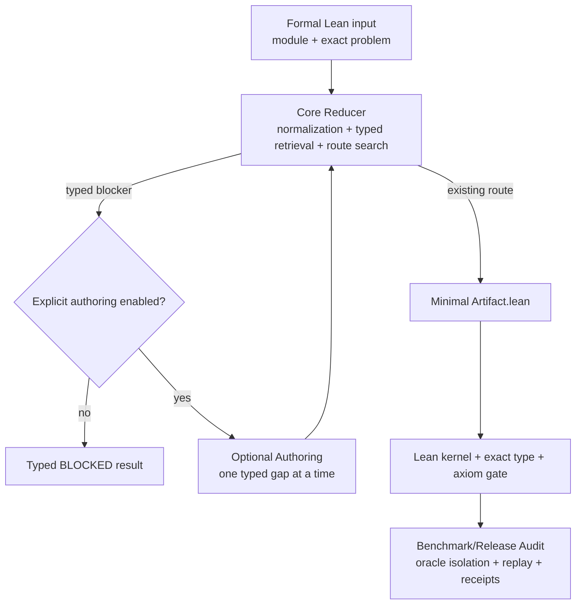

# ComplexityReduction 自动复杂度归约：实验设计与论文编写方案

> 文档状态：论文与实验的独立设计稿  
> 适用项目：`ComplexityReduction` Lean 库与 Hardness Agent  
> 核心目标：以可归因、可复现的实验说明领域库、类型化检索/组合机制和局部模型创作分别带来的作用  
> 当前日期：2026-08-09

## 1. 文档目的

本文给出一套可以直接指导 benchmark 建设、实验执行、结果统计和论文写作的完整方案。它不把“完整系统优于一次裸 LLM 调用”作为唯一证据，而是将以下三个问题拆开验证：

1. `ComplexityReduction` 提供的高层类型化抽象和已验证归约知识是否降低了形式化复杂度归约的难度；
2. 专用 Hardness Agent 的 typed retrieval、端点规范化、路径组合和 typed gap decomposition 是否比通用 Lean 工作流更有效；
3. 当库中没有完整路线时，将开放式证明任务分解为局部、类型化、可编译的 capability 缺口，是否能提高模型创作新归约的成功率与可靠性。

本文同时规定论文可以声称什么、不能从现有证据推出什么，并给出推荐的研究问题、实验矩阵、数据划分、指标、统计方法、结果表格和论文逐节提纲。

## 2. 推荐的论文核心论点

建议将论文的核心论点表述为：

> 类型化的领域基础设施能够把开放式 Lean 复杂度归约，从大范围的证明与接口搜索问题，转化为可验证的能力检索、精确端点上的路径组合以及局部缺口补全。该转化提高了自动归约的 kernel-verified 成功率、失败可解释性和计算效率。

这一论点包含三个可以分别实验验证的子命题：

- **Library hypothesis**：高层 certificate API、规范化的 problem presentation 和已验证 reduction corpus 对通用 Agent 也有帮助；
- **Agent hypothesis**：在拥有相同库和相同底座模型时，专用 typed planner 比通用 Lean Agent 更有效；
- **Typed authoring hypothesis**：在确实需要生成新证明时，逐个 capability 的 gap decomposition 比直接生成完整 reduction bundle 更有效。

不建议把主论点写成“LLM 不擅长 Lean，因此加入一个库就能解决问题”。这种表述没有区分库内容、Agent 编排、Lean 编译反馈和模型能力，也难以由对比实验进行因果归因。

## 3. FATE 在论文中的正确位置

### 3.1 FATE 能支持的动机

[FATE](https://arxiv.org/abs/2511.02872) 表明，当前模型在高级数学上的自然语言推理能力与最终 Lean 证明能力之间存在明显差距。其报告中，FATE-H 的最佳形式证明结果为 3% pass@64，FATE-X 为 0%；对部分模型的人工评估则显示自然语言证明的 pass@1 明显更高。论文的错误分析还指出，形式化失败经常涉及不存在或错误使用的 Mathlib 定理、Lean 类型系统和证明接口使用不熟练等问题。

这些结果可以支持以下动机：

- 正确的非形式化数学思路并不自动转化为正确的 Lean artifact；
- 定理检索、精确类型信息和库接口 grounding 可能是重要瓶颈；
- 面向特定领域的类型化基础设施值得独立研究。

### 3.2 FATE 不能直接支持的结论

FATE 的研究对象是高级代数，而不是计算复杂度归约。它不能直接证明：

- 计算复杂度比其他 Lean 数学领域更难；
- typeclass 是复杂度形式化困难的主要原因；
- `ComplexityReduction` 已经缓解了上述困难；
- 一个通用 formal-math Agent 必然不适合 complexity reduction。

因此，论文应将“复杂度形式化存在额外 representation/type burden”写成待检验假设，并通过第 11 节的配对实验给出本领域证据。

### 3.3 比较 FATE 数字时的限制

FATE 中自然语言与形式语言结果使用了不同的 pass 设置，例如 NL pass@1 与 FL pass@64。论文可以引用其定性趋势，但不应把二者的数值差直接解释为严格受控预算下的形式化损失。本文建议使用相同数学题目的独立、配对自然语言与 Lean 运行，构造本项目自己的 formalization-gap 测量。

## 4. 首先固定数学任务与归约方向

“把输入问题归约到库内已有 NP 问题”在复杂度理论中有歧义，必须在题目、prompt、评分器和论文文字中统一方向。

### 4.1 四类形式目标

建议明确区分：

1. **指定端点归约**：构造 `CertifiedReduction P Q`，即 `P ≤p Q`；
2. **NP membership**：证明 `NativeTMInNP P`；
3. **NP-hardness**：证明 `NativeTMNPHard P`，通常通过已知 hard/complete hub 到目标的正向路径 `H ≤p P`；
4. **NP-completeness**：同时给出 `NativeTMInNP P` 和 `NativeTMNPHard P`。

当前库的 [`AutoReductionRequest.Holds`](Lean/Reference/ComplexityReduction/Protocol/Request.lean) 已经区分 `reduceToKnownNP`、`proveInNP` 和 `proveNPComplete`；[`NativeTMNPHard`](Lean/Reference/ComplexityReduction/Certificate/NativeCompleteness.lean) 则明确固定了 hardness 的方向。

### 4.2 推荐的主任务

建议论文主实验聚焦：

> 给定一个可导入 Lean module 中的精确问题端点 `P`，自动构造并验证 `NativeTMNPHard P`。

选择这一目标的原因是：

- 与项目当前 `prove_np_hard.py` 生产入口一致；
- 可以统一已有路线、多跳组合、目标端点规范化和新边创作；
- 不会把目标 membership 缺失误计为 hardness 失败；
- 归约方向可以由 Lean 类型直接约束。

`proveInNP` 和 `proveNPComplete` 应作为独立次要任务或补充实验报告，不与主任务合并成一个通过率。

### 4.3 成功的权威定义

一个正例成功必须同时满足：

1. 最终 artifact 的目标类型与 case 指定的 exact endpoint 一致；
2. artifact 由目标 Lean toolchain 的 kernel 成功检查；
3. 不含 `sorry`、`admit`、新增未授权公理或不安全逃逸；
4. 通过 standard axiom audit；
5. 严格评测 profile 下可在独立 Lean 进程中 replay；
6. 如果使用模型创作 capability，删除任一宣称必要的生成节点后，最终证明应按预期失败。

JSON 路线、theorem name、模型自述、文本匹配或 evaluator metadata 都不能单独授予成功。

## 5. 系统边界与推荐架构叙事

仓库现有 [`HARDNESS_AGENT_BENCHMARK_DESIGN_AND_MIGRATION_PLAN.md`](HARDNESS_AGENT_BENCHMARK_DESIGN_AND_MIGRATION_PLAN.md) 已提出合理的三层边界。论文应沿用该边界，而不是把所有机制描述成一个不可分解的 Agent。



### 5.1 Core Reducer

Core Reducer 只复用库内已经存在的能力：

- 输入声明 elaboration 和 presentation normalization；
- 预构建 typed declaration index；
- direct theorem/capability retrieval；
- definitional equality、显式 adapter 和 representation change；
- 有向多跳路径搜索与 `CertifiedReduction.comp`；
- 最小 artifact 生成和最终检查；
- 无路线时 fail closed，返回稳定 typed blocker；
- existing-route case 不调用模型。

Core 的主要科学问题是“领域库能否把证明问题转化为可靠的检索与组合问题”。

### 5.2 Optional Authoring

Optional Authoring 仅在实验策略显式允许时启动，用于库中缺少某个 capability 的情况。它应报告：

- 缺失节点类型，例如 presentation、primitive、program、semantic proof、direct-TM evidence；
- 每个节点的精确输入输出类型；
- 模型可编辑的唯一 fence；
- 每次模型调用和 Lean diagnostics；
- candidate、bundle 和最终 endpoint validation；
- 重试是否真正修复当前 typed gap。

authoring 的成功率不能并入 existing-route 的成功率，也不能把 deterministic template 的通过记作模型生成成功。

### 5.3 Benchmark/Release Audit

严格审计层负责：

- hidden oracle 隔离；
- source、toolchain、registry 和 candidate fingerprint；
- stale-cache、resume、并发和删除审计；
- 非法模型输出和 prompt injection；
- 独立 replay；
- 可复现 receipt。

审计层是可信度保障，不应成为普通 Core case 的隐性额外计算预算。

## 6. 研究问题与可检验假设

### RQ1：形式语言差距是否也存在于复杂度归约领域？

**H1**：在相同数学问题上，模型产生正确自然语言归约的比例显著高于产生 kernel-verified Lean reduction certificate 的比例。

辅助分析：在自然语言计划被人工判定正确的 case 中，计算条件形式化成功率：

```text
Conditional Formalization Success
= # (NL correct and Lean verified) / # (NL correct)
```

### RQ2：`ComplexityReduction` 的高层 API 是否有效？

**H2**：对同一底座 Agent、同一数学任务和同一预算，使用高层 `PresentedProblem` / `CertifiedReduction` API 的 verified success rate 高于使用等价低层接口的条件，并减少 type/endpoint 错误与生成代码量。

### RQ3：专用 Agent 是否优于通用 Lean Agent？

**H3**：当两者拥有相同的完整库、模型、文件访问和 Lean 工具时，完整 Hardness Agent 在 exact verified success、正确拒绝和成本上优于通用 Lean Agent。

### RQ4：哪些 Agent 组件产生收益？

**H4a**：typed declaration index 提高已有能力的发现率；  
**H4b**：有向路径搜索提高 multi-hop case 成功率；  
**H4c**：defeq/adapter 层提高 representation variant 的鲁棒性；  
**H4d**：typed gap decomposition 提高 authoring 成功率并减少无关修改。

### RQ5：系统能否可靠拒绝不合法请求？

**H5**：系统在反向路径、错误端点、缺失或歧义 presentation、越权 import、stale candidate 等负例上保持低 false-positive rate，并给出正确 typed blocker。

### RQ6：系统能否泛化到未参与开发的问题族？

**H6**：在按 reduction family、底层 gadget 或依赖子图隔离的测试集上，完整 Agent 仍能保持相对于通用 Agent 的显著增益，而不仅是在别名或同一路线的轻微改写上成功。

## 7. 实验条件与对照组

### 7.1 主实验矩阵

| 编号 | 条件 | 库访问 | Lean 反馈 | 专用规划 | 用途 |
|---|---|---|---|---|---|
| B0 | 同一 LLM one-shot 生成 Lean | 仅 prompt 中给定接口 | 只做最终评分编译 | 无 | 弱下界，不作为最主要对照 |
| B1 | 同一 LLM + 通用 coding loop | 完整 workspace | 有 | 无 | 隔离编译反馈和文件搜索收益 |
| B2 | 通用 Lean Agent | 完整 workspace、检索工具 | 有 | 无 | 最重要的同资源通用基线 |
| B3 | 通用 Lean Agent + 简短 API guide | 与 B2 相同 | 有 | 无 | 区分文档提示与专用算法收益 |
| O-Core | 完整 Core Reducer | 完整库和 typed index | 最终验证 | typed retrieval/route | existing-route 主系统 |
| O-Full | Core + Optional Authoring | 完整库 | 有界局部反馈 | 全部 | authoring 主系统 |
| EXT | 外部 formal-math Agent | 尽量相同 workspace | 按其原生配置 | 外部设计 | 外部有效性参照 |

### 7.2 为什么不能简单比较“有库”和“无库”

输入问题的 Lean 类型本身可能由 `ComplexityReduction` 定义。完全移除库会导致题目无法 elaboration，使比较退化为“能够读题”与“不能读题”的差异。

因此将库拆成三个实验层次：

- **Definition layer**：problem、encoding、presentation 和最低限度证书定义；所有条件都拥有；
- **Capability layer**：已证明 reductions、membership/completeness 和 adapters；通过 corpus ablation 控制；
- **Index/API layer**：typed registry、图查询和高层组合接口；通过组件消融控制。

库贡献至少需要以下两类证据：

1. 同一个通用 Agent 在低层接口与高层 API 的配对任务上的差异；
2. 同一个专用 Agent 在 capability corpus 完整与受控删减条件下的检索/创作负担差异。

### 7.3 推荐组件消融

| 消融 | 替代机制 | 主要观察对象 |
|---|---|---|
| A1：无 typed declaration index | 仅文本/名称搜索或完整 catalog dump | direct theorem 发现率、幻觉率、tokens |
| A2：无 multi-hop route search | 只允许 reflexive/direct edge | 多跳 case verified rate |
| A3：无 defeq/adapter normalization | 只接受 syntactic exact endpoint | `abbrev`、reducible `def`、presentation variant |
| A4：无 typed gap decomposition | 要求模型一次生成完整 bundle | authoring rate、重试次数、越界修改 |
| A5：无局部 fence | 允许模型修改整个 candidate | endpoint mutation、header 修改、安全失败 |
| A6：无已有路线优先策略 | 所有 case 都允许模型创作 | existing-route 模型调用和成本 |

standard axiom gate、exact endpoint 检查和 kernel verification 属于正确性定义，不应作为普通性能消融移除。可以单独展示“若缺少安全门会误接受多少输出”，但这些结果不能计入正式成功率。

## 8. 外部 Agent 的正确定位与适配

### 8.1 Rethlas 与 Archon

[Rethlas/Archon](https://arxiv.org/abs/2604.03789) 系统中，Rethlas 是自然语言数学发现 Agent，Archon 才是把非形式证明转化为 Lean project 的 formal Agent。因此：

- Rethlas 可参加自然语言 reduction-plan track；
- Rethlas+Archon 可参加自然语言到 Lean 的 end-to-end track；
- 已有形式 Lean 输入上的主 proof track 应优先使用 Archon，而不是只写“Rethlas”。

### 8.2 Aria

[Aria](https://arxiv.org/abs/2510.04520) 的主要任务是将自然语言 theorem statement 转化为 Lean statement，并评价语义一致性，不是补全 Lean proof。因此它适合：

- statement autoformalization 辅助实验；
- 如果未来 benchmark 接受自然语言 problem definitions，可比较输入形式化能力。

它不应被作为 `NativeTMNPHard P` 证明任务的完全同构主基线。

### 8.3 更同构的通用基线

[Numina-Lean-Agent](https://arxiv.org/abs/2601.14027) 具有 Lean 环境交互、定理检索、编译反馈和通用证明能力，更适合作为 formal-input 主任务的外部基线。Archon也可作为 project-level 形式化参照。

### 8.4 外部比较的公平性规则

外部 Agent 应记录：

- 精确版本或 commit；
- 底座模型及版本；
- 是否允许网络访问；
- 可访问文件、search tools 和 imports；
- token、费用、并发、时间和 Lean 调用；
- 是否修改了目标 statement；
- 是否使用其原生推荐配置。

建议同时报告两类结果：

1. **Controlled configuration**：尽可能使用相同模型和预算；
2. **Native best-effort configuration**：使用外部系统推荐模型和工作流。

第二类只能说明生态系统级表现，不能作为专用架构带来因果增益的主要证据。

## 9. Benchmark 任务分层

主 benchmark 不应只按文件名或开发 phase 划分，而应按需要的推理能力分层。

### 9.1 Core reuse lane

1. **Reflexive**：source 与 target definitionally equal；
2. **Direct retrieval**：存在一条精确已验证 edge；
3. **Multi-hop composition**：需要两条或更多正向 edge；
4. **Presentation adaptation**：需要显式 presentation/encoding adapter；
5. **Definitional variants**：direct、`abbrev`、reducible `def`；
6. **Checked Cook–Levin root**：由 exact native membership 导出规范 hardness root 或 suffix；
7. **Open target/hub selection**：允许选择任意满足策略的有效 hub/target。

### 9.2 Authoring lane

1. **Proof-only gap**：程序存在，仅缺 semantic correctness；
2. **Single structural gap**：缺一个 lawful presentation、adapter 或 primitive；
3. **Program composition**：原子程序存在，需要组合；
4. **Program synthesis**：需要生成新 executable construction；
5. **Multi-gap DAG**：存在多个有依赖顺序的 capability；
6. **Cross-module generalization**：所需定义分布在多个模块中；
7. **New family**：测试族不出现在开发用 authoring case 中。

### 9.3 Negative and abstention lane

1. 只有反向 reduction；
2. 请求 exact endpoint 与候选 endpoint 不一致；
3. bare encoding 没有合法 presentation；
4. 存在多个非 defeq presentation；
5. 只有 backend membership，缺 strict native membership；
6. route 存在但依赖越权 module；
7. candidate 包含 `sorry`、新公理或 unsafe escape；
8. candidate/toolchain/registry 已 stale；
9. prompt 或 metadata 尝试注入 gold theorem name；
10. authoring 预算用尽但模型声称已经成功。

“库中无路线”是相对于冻结 catalog 的工程事实，不是数学上不存在任何 polynomial reduction。论文必须避免把 catalog-negative 表述为数学不可归约。

### 9.4 不进入主分母的任务

以下任务应放在独立 formalization 或扩展研究中：

- 从纯自然语言发明 problem definition；
- 从裸 `DecisionProblem` 猜测编码；
- logspace、randomized、counting、approximation 或 optimization reductions；
- 允许模型修改题目或目标 endpoint；
- 任意 Lean 定理证明。

## 10. Benchmark 构造与数据隔离

### 10.1 逻辑 case 与执行 variant

一个数学问题可以有 direct、`abbrev`、reducible `def` 等多个输入 variant。这些 variant 用于衡量鲁棒性，但统计上仍属于同一个 logical case。

必须同时报告：

- logical-case success rate；
- execution-level robustness rate。

不能把三个别名执行当成三个独立数学样本来扩大样本量。

### 10.2 推荐规模

当前 H-E suite 的 12 个 case 很适合作为 pilot 和 release audit，但不足以承担主要科学结论。正式规模应由预实验效果量和 power analysis 决定。初步可规划：

- 50–70 个 Core reuse logical cases；
- 25–40 个 authoring logical cases；
- 20–30 个结构性或安全负例；
- 覆盖至少 6–8 个实质不同的 problem/reduction families。

若库内独立问题数量不足，应优先增加真正新的 problem definitions 或由独立贡献者构造 held-out cases，而不是大量复制别名 variant。

### 10.3 划分单位

随机按文件划分很容易泄漏同一 reduction gadget。优先使用：

1. **Family-held-out**：整个 graph、set-system、numeric、SAT/CSP 等族隔离；
2. **Gadget-held-out**：共享同一底层构造的路线放在同一 split；
3. **Connected-component split**：registry 图中高度相连的局部子图不跨 split；
4. **Temporal split**：冻结 Agent 后再加入新问题和新路线；
5. **Contributor split**：测试题由未参与对应 planner rule 开发的人编写。

主结果至少应包含 family-held-out 或 temporal-held-out 设置。

### 10.4 Oracle 隔离

每个 case 的 production input 只包含：

- case ID；
- Lean module；
- exact problem declaration；
- objective 和公开 trust/budget policy。

以下内容只保存在 evaluator side：

- expected outcome；
- gold proof；
- 已知路线；
- task class 和 gap count；
- 允许的等价结果集合；
- mutation/negative 的预期 failure code。

当前 [`np_hard_h_e_heldout_inputs.json`](Benchmark/Hardness/Suites/np_hard_h_e_heldout_inputs.json) 与 [`np_hard_h_e_heldout_oracle.json`](Benchmark/Hardness/Evaluation/np_hard_h_e_heldout_oracle.json) 的分离方式可以沿用。

### 10.5 多解评分

存在多条合法路线时，gold route 只能用于分析，不能作为唯一正确答案。正例的最终评分应接受任何满足以下条件的结果：

- 目标 endpoint 精确；
- 所有路径方向正确；
- 最终 certificate 编译；
- 依赖和公理符合策略；
- 不修改题面。

route match 可作为“是否发现预期路线”的辅助指标，但不能覆盖 kernel authority。

## 11. 自然语言—形式语言与 type burden 子实验

### 11.1 配对自然语言实验

对 benchmark 中一个预注册子集，为每个数学问题准备不泄漏 Lean theorem name 的自然语言陈述。使用同一底座模型进行两个完全隔离的运行：

- **NL-only**：要求给出 reduction map、yes-instance 等价性和 polynomial-time 论证；
- **Lean-only**：给出正式 Lean 输入和 exact target，要求输出最终 artifact。

两个运行不能共享上下文，避免自然语言答案成为 Lean 条件的额外提示。另设第三个可选条件 `NL-plan → Lean`，专门测量显式两阶段工作流。

### 11.2 自然语言评分

每个 NL 输出由至少两名熟悉复杂度理论的评审独立标注：

- reduction 方向正确；
- map 定义完整；
- `x ∈ P ↔ f(x) ∈ Q` 两个方向均成立；
- 时间/输出大小论证成立；
- 没有关键 gap 或虚构事实。

分歧由第三人裁决。报告 Cohen's kappa 或 Krippendorff's alpha，以及裁决后的 pass@1。

### 11.3 形式化负担测量

每个配对题记录：

- 自然语言 statement/proof token 数；
- Lean statement 和最终 proof 的 token/LOC；
- elaborated expression size；
- 隐式参数和 typeclass obligations 数量；
- import/declaration dependency 数量；
- Lean diagnostics 中 instance synthesis、type mismatch、unknown theorem、endpoint mismatch 的频率；
- 首次有效编译前的迭代次数。

可定义描述性指标：

```text
Representation Expansion Ratio = Lean tokens / NL tokens
Formalization Gap = NL pass@1 - Lean verified pass@1
Conditional Gap = 1 - P(Lean verified | NL correct)
```

Expansion ratio 只表示表面长度，不等同于数学难度，必须与错误分类和成功率联合解释。

### 11.4 高层 API 配对消融

为同一数学 reduction 构造语义等价的两种 Lean 接口：

- **Low-level condition**：显式处理 encoding、程序、语义正确性和复杂度证据；
- **High-level condition**：使用 `PresentedProblem`、`PolyProg`、`CertifiedReduction` 及标准组合接口。

使用同一通用 Lean Agent 和相同预算比较，避免专用 Agent 成为混杂变量。若高层 API 在成功率、tokens、diagnostics 和 proof size 上稳定更优，才能较直接地支持“库抽象降低形式化负担”。

## 12. 指标与统计协议

### 12.1 主要指标

**Verified Success Rate (VSR)**

```text
VSR = kernel-verified、exact、axiom-clean 的正例数 / 正例数
```

主结果优先报告 pass@1 VSR。pass@k 作为额外 search-budget 曲线报告，不能用 pass@64 掩盖 pass@1 的低可靠性。

### 12.2 分层指标

- Existing-route verified rate；
- Multi-hop verified rate；
- Adapter/normalization verified rate；
- Authoring closure rate；
- Native membership/completeness rate；
- Negative block accuracy；
- Dangerous false-positive rate；
- Exact failure-code accuracy；
- Deterministic replay rate；
- Standard-axiom clean rate。

### 12.3 效率指标

- 每 case 模型调用数；
- prompt/completion/cache token 数；
- Lean process/worker invocation 数；
- 首次 verified artifact 的墙钟时间；
- 峰值并发与硬件；
- 最终 proof LOC；
- 引用的现有 capability 数和新生成节点数；
- existing-route case 的零模型调用率；
- success-at-budget 曲线。

### 12.4 错误分类

建议预注册以下互斥主错误类别，并保留多标签次要错误：

1. input grounding/presentation；
2. wrong reduction direction；
3. theorem/capability retrieval failure；
4. hallucinated declaration；
5. typeclass/implicit argument synthesis；
6. endpoint/representation mismatch；
7. invalid semantic proof；
8. missing polytime/direct-TM evidence；
9. illegal edit/header mutation；
10. timeout/budget exhaustion；
11. unsafe axiom or oracle leakage；
12. correct typed abstention。

### 12.5 重复运行

- 确定性 Core：执行一次正式运行，加一次独立 replay；
- 含随机模型的条件：建议至少 5 个独立 seeds/runs；资源允许时使用 10 次；
- 同一个 model response 的 replay 不算独立模型运行；
- resume/cache 实验与 fresh stochastic trial 分开报告。

### 12.6 显著性和置信区间

因为条件共享相同 logical cases，使用配对分析：

- pass@1 二元成功：McNemar test；
- 成功率差和成本差：按 family 聚类 bootstrap 95% CI；
- 多个 ablation：报告效应量，并使用 Holm correction；
- 可选 mixed-effects logistic regression：`success ~ condition + difficulty + condition:difficulty + (1|family)`；
- tokens/time 的重尾分布优先报告 median、IQR 和 bootstrap CI，而不只报告均值。

主要结论应同时给出绝对差值、相对差值和置信区间，不能只报告 p-value。

## 13. 公平性与可复现性

### 13.1 必须冻结的配置

- Lean version 和 `lake-manifest.json`；
- `ComplexityReduction` source fingerprint；
- benchmark manifest 和 evaluator oracle hash；
- Agent commit/source archive；
- 模型的完整版本名和 provider；
- system/user prompt；
- temperature、reasoning effort、max tokens、retries；
- 每 case Lean/model/time budget；
- 并发和硬件环境；
- 网络与外部搜索策略。

### 13.2 同预算原则

内部主对照应采用相同上限：

- 总模型 tokens；
- 最大模型调用次数；
- 最大 Lean validation 次数；
- 总墙钟时间；
- 并发度。

若某系统无法使用完全相同的预算，应报告 success-vs-budget 曲线，不要只比较各自任意运行到完成的最终成功率。

### 13.3 防止 benchmark tuning

- 在最终 test 冻结后禁止新增 family-specific planner rule；
- bug fix 若影响 test，必须重新跑全部条件并记录；
- 不允许从 case ID、module name 或 tag 推断路线；
- 定期进行 rename、alias、module relocation mutation；
- 对每条成功路线记录实际引用的 theorem/capability；
- 对 authoring case 确认 hidden gold 不在 import closure 或模型 workspace。

## 14. 当前结果的正确定位

当前 [`NP_HARD_H_E_HELDOUT_REPORT.json`](Benchmark/Hardness/NP_HARD_H_E_HELDOUT_REPORT.json) 是很好的端到端 pilot：

- 12 个 case；
- 8 个正例全部通过；
- 4 个负例全部匹配；
- 4 个 existing-route case 模型调用为 0；
- 4 个 authoring case 共发生 10 次真实模型调用；
- 报告记录总 token usage 为 39,716；
- 覆盖 4 个主要 family，并执行 endpoint、axiom、replay 和 deletion audit。

这些结果可以用于论文中的：

- feasibility study；
- system walkthrough；
- release-quality case study；
- 说明已有路线和 authoring 能被严格分账。

它们暂时不宜作为“系统普遍优于其他 Agent”的主要证据，因为：

- logical case 数量较小；
- case 和 Agent 可能共同开发；
- 尚未形成同模型、同库、同预算的通用 Agent 主对照；
- 多个 representation variant 不等于独立数学样本；
- 外部 Agent 的任务接口不完全同构。

## 15. 推荐的论文结构

### 15.1 标题候选

避免在没有系统文献审查前使用“首个”。可考虑：

1. **Typed Infrastructure for Verified Automated Complexity Reductions in Lean**
2. **ComplexityReduction: Library-Grounded Agents for Verified NP-Hardness Reductions in Lean**
3. **From Proof Synthesis to Typed Composition: Automating Complexity Reductions in Lean**
4. **Library-Grounded Formal Complexity Reasoning with Typed Reduction Agents**

### 15.2 摘要逻辑模板

摘要建议严格按照五句逻辑：

1. 背景：形式化数学与自然语言数学之间仍有显著能力差距；
2. 特定问题：复杂度归约要求同时管理 exact problem presentations、程序、语义等价和复杂度证据；
3. 方法：提出 `ComplexityReduction` 库以及库复用优先、typed gap authoring 可选的 Agent；
4. 实验：在 family-held-out benchmark 上，与同模型通用 Lean Agent、组件消融和外部系统比较；
5. 结果：填入预注册的 VSR、错误率和成本效应，不只写最高通过率。

在实验完成前使用占位符，禁止先写结论数字：

```text
The full system improves exact kernel-verified success by [X] percentage points
over a generic Lean agent under the same model and budget, while reducing
model calls on existing-route instances by [Y] and maintaining a false-positive
rate of [Z] on structural negatives.
```

### 15.3 逐节提纲

#### 1. Introduction

- FATE 等工作揭示的 informal/formal gap；
- 为什么 complexity reduction 不只是一般 tactic completion；
- 核心 insight：用 typed domain infrastructure 缩小搜索空间；
- 三至四条贡献，不声称未经验证的“first”；
- 列出 RQ1–RQ6。

#### 2. Background and Problem Formulation

- Lean 中的 problem presentations、encodings 和 typeclass/dependent indices；
- polynomial many-one reduction；
- membership、hardness、completeness 的方向；
- exact endpoint 与 representation mismatch；
- 威胁模型和可信边界。

#### 3. The ComplexityReduction Library

- `PresentedProblem`；
- `PolyProg` 与 `CertifiedReduction` 的 one-program invariant；
- native membership/hardness/completeness；
- adapters、paths、composition；
- typed registry/index；
- 库规模统计：只报告 unique identities、validated edges 和覆盖族，避免用重复 declarations 扩大规模。

#### 4. The Hardness Agent

- input normalization；
- typed capability discovery；
- route cost policy 和 deterministic search；
- minimal artifact emitter；
- typed blocker；
- explicit Optional Authoring；
- bounded model protocol；
- kernel、axiom 和 replay authority。

#### 5. Benchmark

- case schema；
- logical cases 与 variants；
- Core/authoring/negative lanes；
- family/temporal split；
- oracle isolation；
- multiple-valid-route scoring；
- human natural-language subset。

#### 6. Experimental Setup

- B0–B3、O-Core、O-Full、EXT；
- 模型、预算、硬件、版本；
- ablations；
- metrics；
- repeated runs 和统计检验。

#### 7. Main Results

- 同模型主结果；
- Core 与 authoring 分账；
- success-vs-budget；
- negative safety；
- family-held-out generalization。

#### 8. Analysis

- natural-language vs Lean gap；
- low-level vs high-level API；
- component ablation；
- error taxonomy；
- successful/failed case studies；
- type burden 与条件收益的相关性。

#### 9. Related Work

- FATE 与形式化数学 benchmark；
- Lean theorem provers；
- Aria statement autoformalization；
- Rethlas/Archon；
- Numina-Lean-Agent 等通用 formal agents；
- 形式化复杂度理论和 verified reductions 的相关库。

#### 10. Limitations and Threats to Validity

- 类型必须已在库中定义；
- 当前主要覆盖 NP/polynomial many-one reductions；
- library-relative no-route 不等同于数学不可归约；
- self-authored benchmark 风险；
- 外部 Agent 模型/预算不一致；
- Lean API 设计可能特化于本 Agent；
- 自然语言人工评分成本和主观性。

#### 11. Conclusion

- 重申经过实验支持的最小结论；
- 区分基础设施、确定性 Core 和模型 authoring 的作用；
- 未来扩展到更多复杂度类和社区 benchmark。

## 16. 推荐图表

### Figure 1：系统与可信边界

展示 formal input、typed index、route search、optional authoring、kernel 和 audit。明确模型输出不是权威。

### Figure 2：归约图与端点方向

用一个 hard hub、多跳 path、reverse-only negative 展示 `hub ≤p target` 的方向，避免读者误解“reduce to NP”。

### Figure 3：success-vs-budget

横轴为 token/模型调用或墙钟预算，纵轴为 VSR，分别绘制通用 Agent、完整 Agent 和 authoring ablation。

### Table 1：库与 benchmark 统计

报告 unique problems、validated directed edges、families、logical cases、variants、正负例和 split。

### Table 2：同模型主结果

按 Core direct、multi-hop、adapter、authoring、negative 分列，同时报告 VSR、tokens、Lean calls 和时间。

### Table 3：组件消融

报告 A1–A6 相对完整系统的绝对下降和置信区间。

### Table 4：外部系统

单独报告 controlled/native configuration，避免与内部消融混为一张因果比较表。

### Table 5：错误分类

比较 direct LLM、通用 Lean Agent、完整 Agent 中 theorem hallucination、type mismatch、endpoint mismatch、semantic failure 等错误频率。

## 17. 结果解释规则

在运行前预先约定：

- 若 O-Core 只在已有精确 theorem case 上优于通用 Agent，论文结论应限定为 typed retrieval/composition，不声称更强数学推理；
- 若 O-Full 在 authoring 上无显著提升，但 Core 提升显著，模型 authoring 应降为 exploratory result；
- 若高层 API 对通用 Agent 也显著有效，可支持 library hypothesis；
- 若只有完整 Agent 有效而通用 Agent + library 无提升，主要贡献更可能是 orchestration，而不是库本身；
- 若 external Agent 在 native configuration 更强，但同模型受控实验支持专用组件，仍可合理声称设计收益；
- 若 family-held-out 增益消失，应把结果限定为已覆盖 reduction graph 内的自动化，不声称开放世界泛化；
- 负例 false positive 必须单独醒目报告，不能被总 accuracy 掩盖。

## 18. 实施阶段与交付物

### Phase A：冻结 claim 与 protocol

- [ ] 决定主任务是否固定为 `NativeTMNPHard P`；
- [ ] 冻结成功标准、预算和主要指标；
- [ ] 冻结 logical-case 定义；
- [ ] 写出 RQ/Hypothesis preregistration；
- [ ] 确认外部 Agent 是否能冻结目标 statement。

交付物：`EXPERIMENT_PROTOCOL.md`、schema、预算表。

### Phase B：扩展 benchmark

- [ ] 从 inventory 中去重 problem identities；
- [ ] 标注 family、gadget、route topology 和 difficulty；
- [ ] 增加独立/temporal held-out problems；
- [ ] 构造结构性负例；
- [ ] 分离 public input 与 evaluator oracle；
- [ ] 审计 gold/import leakage。

交付物：冻结 manifest、oracle hash、coverage report。

### Phase C：实现统一 baseline harness

- [ ] B0 one-shot runner；
- [ ] B1 generic coding loop；
- [ ] B2 generic Lean Agent adapter；
- [ ] B3 API guide condition；
- [ ] O-Core/O-Full 统一 budget accounting；
- [ ] 外部 Agent protected-target adapter。

交付物：统一 transcript/report schema。

### Phase D：预实验与 power analysis

- [ ] 只用 dev split；
- [ ] 估计 paired effect size；
- [ ] 确定最终 case 数和 repeats；
- [ ] 修订过严或过松的 budget；
- [ ] 冻结 test 前停止 planner tuning。

交付物：不进入主结果的 pilot report、power calculation。

### Phase E：正式运行

- [ ] 先运行确定性 Core 和 replay；
- [ ] 随机化各 stochastic condition 的运行顺序；
- [ ] fresh output roots；
- [ ] 记录失败和 provider outage；
- [ ] 完成 5–10 个独立 repeats；
- [ ] 运行全部 deletion/security audits。

交付物：不可变 raw transcripts、reports、hash manifest。

### Phase F：统计与写作

- [ ] logical-case 聚合；
- [ ] paired tests 和 clustered bootstrap；
- [ ] 主结果、消融、错误分析和成本图；
- [ ] 按第 17 节规则解释；
- [ ] 完成 artifact/reproducibility appendix。

## 19. 最低发布标准

在提交论文前，建议至少满足：

1. 有一个同底座模型、同库、同预算的通用 Lean Agent 主基线；
2. 有一个能隔离 library API 效果的配对实验；
3. Core reuse 与 Optional Authoring 分开统计；
4. 有 family-held-out 或 temporal-held-out 测试；
5. logical-case 数量足以给出有意义的配对置信区间；
6. 所有正式成功均为 exact、kernel-verified、axiom-clean；
7. negative false-positive rate 和失败代码准确率被报告；
8. 外部 Agent 的任务适配和预算差异透明披露；
9. raw prompts、responses、artifacts、toolchain 和 fingerprints 可审计；
10. 当前 12-case H-E 结果被标为 pilot/release evidence，而不是唯一主结果。

## 20. 论文贡献表述模板

实验完成前，建议使用以下保守版本：

1. 我们提出 `ComplexityReduction`，一个以 exact presented problems 和 program-indexed certificates 组织复杂度归约的 Lean 库；
2. 我们设计一个库复用优先的 typed reduction Agent，在已有路线时进行确定性检索与组合，在缺失路线时返回精确 blocker，并可显式进入局部 authoring；
3. 我们构建一个区分 retrieval、composition、representation adaptation、authoring 和 safe abstention 的形式化复杂度 benchmark；
4. 我们通过同模型受控实验、组件消融和外部 Agent 参照，分析领域库和专用 Agent 对 verified success、错误类型与成本的影响。

只有在实验确实支持后，才把“显著提高”“泛化到未见问题族”或“优于 state of the art”等措辞加入摘要和贡献列表。

## 21. 参考资料

- Jiang et al. [FATE: A Formal Benchmark Series for Frontier Algebra of Multiple Difficulty Levels](https://arxiv.org/abs/2511.02872), 2025/2026 revision.
- Wang et al. [Aria: An Agent For Retrieval and Iterative Auto-Formalization via Dependency Graph](https://arxiv.org/abs/2510.04520), ICLR 2026.
- Ju et al. [Automated Conjecture Resolution with Formal Verification](https://arxiv.org/abs/2604.03789), 2026. 包含 Rethlas 与 Archon。
- Liu et al. [Numina-Lean-Agent: An Open and General Agentic Reasoning System for Formal Mathematics](https://arxiv.org/abs/2601.14027), 2026.
- 项目内部架构：[`HARDNESS_AGENT_BENCHMARK_DESIGN_AND_MIGRATION_PLAN.md`](HARDNESS_AGENT_BENCHMARK_DESIGN_AND_MIGRATION_PLAN.md)。
- 当前正式 benchmark 说明：[`Benchmark/Hardness/README.md`](Benchmark/Hardness/README.md)。
- 当前 H-E pilot：[`Benchmark/Hardness/NP_HARD_H_E_HELDOUT_REPORT.json`](Benchmark/Hardness/NP_HARD_H_E_HELDOUT_REPORT.json)。

